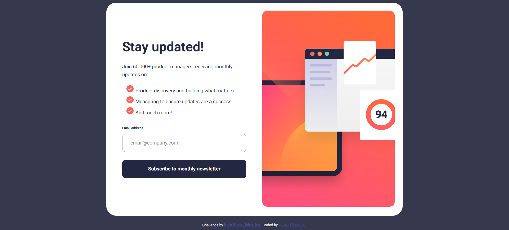

# Frontend Mentor - Newsletter sign-up form with success message solution

This is a solution to the [Newsletter sign-up form with success message challenge on Frontend Mentor](https://www.frontendmentor.io/challenges/newsletter-signup-form-with-success-message-3FC1AZbNrv). Frontend Mentor challenges help you improve your coding skills by building realistic projects.

## Table of contents

- [Overview](#overview)
  - [The challenge](#the-challenge)
  - [Screenshot](#screenshot)
  - [Links](#links)
- [My process](#my-process)
  - [Built with](#built-with)
  - [What I learned](#what-i-learned)
  - [Continued development](#continued-development)
  - [Useful resources](#useful-resources)
- [Author](#author)

## Overview

### The challenge

Users should be able to:

- Add their email and submit the form
- See a success message with their email after successfully submitting the form
- See form validation messages if:
  - The field is left empty
  - The email address is not formatted correctly
- View the optimal layout for the interface depending on their device's screen size
- See hover and focus states for all interactive elements on the page

### Screenshot



### Links

- [Solution URL](https://github.com/liviagomesa/sign-up-form)
- [Live Site URL](https://liviagomesa.github.io/sign-up-form/)

## My process

### Built with

- Semantic HTML5 markup
- CSS custom properties
- Flexbox
- CSS Grid
- Mobile-first workflow

### What I learned

1. I've learned to include the code `line-height: 1` to delete all line spacing of my project.

2. I've learned that the text height is measured from its highest point (for example, from the top of a capital letter) to its lowest point (for example, at the base of a letter y).

3. `event.preventDefault();` This code blocks the default behavior of the form submit, i.e. the behavior of realoading the page or redirecting it to the URL specified in the "action" attribute.

4. To centralize page content (vertically and horizontally):

```css
html {
  display: flex;
  justify-content: center;
  align-items: center;
  background-color: hsl(235, 18%, 26%);
  height: 100%;
}
```

### Continued development

I'm not completely comfortable with the concepts and techniques below - but I think they're useful and I want to refine by focusing in future projects:

- JavaScript
- float CSS property

### Useful resources

- [ChatGPT](https://chat.openai.com/) - This helped me a lot, with all my doubts.

## Author

- Frontend Mentor - [@liviagomesa](https://www.frontendmentor.io/profile/liviagomesa)
- LinkedIn - [@liviagomesa](https://www.linkedin.com/in/liviagomesa/)
